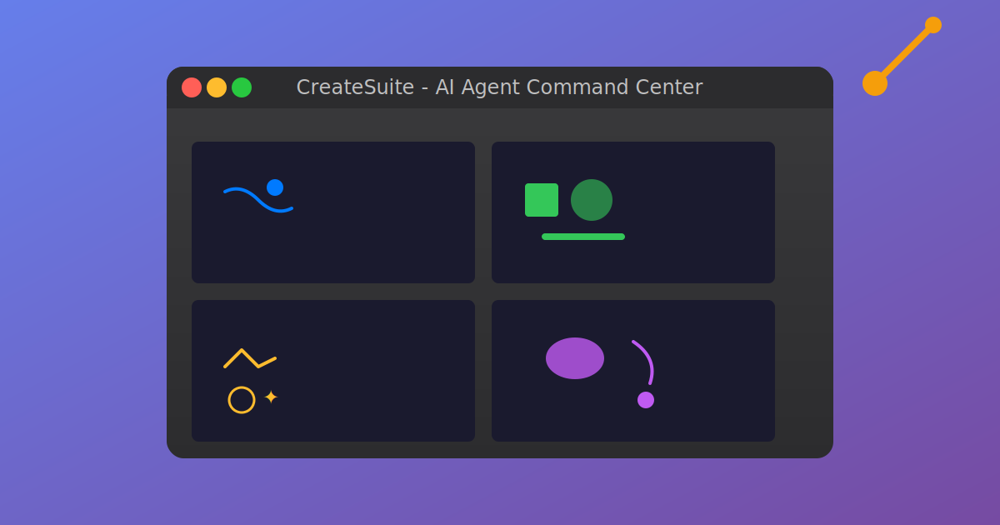

# 🖥️ CreateSuite Agent UI

**Your AI agents deserve a proper command center.**

A nostalgic macOS-styled desktop environment for orchestrating AI coding agents. Run Claude, GPT, Gemini, and other AI assistants in parallel terminal sessions, all from one delightfully polished interface.



## ✨ Features

| Feature | Description |
|---------|-------------|
| 🪟 **Multi-Window Desktop** | Drag, resize, and manage multiple terminal windows |
| 🤖 **Agent Dashboard** | Spawn and manage AI agents on Fly.io machines |
| 🚀 **Multi-Agent Support** | Run Claude, GPT, Gemini, and more in parallel |
| ⏱️ **Smart Lifecycle** | Auto-shutdown when work completes (saves 💰!) |
| 🎨 **macOS Aesthetic** | Beautiful desktop with polished interactions |
| 🖥️ **Full Terminal** | Real shell with xterm.js + node-pty |
| 🌐 **Deploy Anywhere** | Fly.io, Render, or run locally |

## 🚀 Quick Start

### All Services (Recommended)

From the project root, a single command starts Phoenix backend, Express server, and Vite frontend:

```bash
# Install dependencies
npm install && cd agent-ui && npm install && cd server && npm install

# Start all services
./scripts/dev.sh start

# Check status
./scripts/dev.sh status

# Stop all services
./scripts/dev.sh stop
```

Services are available at:
- **http://frontend.localhost** — React agent-ui
- **http://phoenix.localhost** — Phoenix REST API + LiveView dashboard
- **http://express.localhost** — Express API + Socket.IO

**Prerequisites**: `portless` CLI (`npm install -g portless`), PostgreSQL on localhost:5432

### Frontend Only

```bash
cd agent-ui && npm install && npm run dev
```

Then open **http://localhost:5173** — note: API calls will 404 without Phoenix + Express running.

### Agent Dashboard

Access the Agent Dashboard to spawn and manage AI agents:

1. Open the UI
2. Click **"Agents"** → **"🤖 Agent Dashboard"**
3. Click an agent type to spawn it on Fly.io
4. Monitor active agents in real-time

See the [Agent Dashboard Guide](../docs/guides/AGENT_DASHBOARD.md) for detailed instructions.

### Keyboard Shortcuts

| Shortcut | Action |
|----------|--------|
| `Ctrl+N` | New Terminal |
| `Ctrl+Shift+N` | Agent Village |
| `Escape` | Close menus |

## 🚢 Deploy to Fly.io

```bash
# First time
fly launch

# Subsequent deploys
./scripts/fly-deploy.sh deploy
```

See [Deployment Guide](../docs/guides/DEPLOY_RENDER.md) for Render and other platforms.

## 🧩 Project Structure

```
agent-ui/
├── src/
│   ├── App.tsx              # Main desktop app
│   ├── components/
│   │   ├── TerminalWindow   # xterm.js terminal
│   │   ├── WelcomeWizard    # First-run experience
│   │   ├── DesktopIcons     # Quick-access icons
│   │   ├── LifecycleNotification  # Auto-shutdown UI
│   │   └── ...
├── server/
│   ├── index.js             # Express + Socket.IO server
│   └── lifecycleManager.js  # Smart container lifecycle
├── public/
│   └── createsuite.svg      # Favicon
└── fly.toml                 # Fly.io config
```

## 🔧 Environment Variables

| Variable | Description | Default |
|----------|-------------|---------|
| `PORT` | Server port | `3001` |
| `ENABLE_PTY` | Enable terminal | `true` |
| `AUTO_SHUTDOWN` | Auto-shutdown when idle | `true` |
| `GRACE_PERIOD_MS` | Grace period before shutdown | `480000` (8 min) |
| `WEBHOOK_URL` | Slack/Discord notifications | - |
| `GITHUB_TOKEN` | For agent-triggered rebuilds | - |

## 📖 Documentation

- [Main README](../README.md) - Full CreateSuite documentation
- [Architecture](../docs/architecture/ARCHITECTURE.md) - System design
- [Deployment](../docs/guides/DEPLOY_RENDER.md) - Production deployment

## 🙌 Contributing

PRs welcome! Check out the [development guide](../docs/guides/GETTING_STARTED.md).
